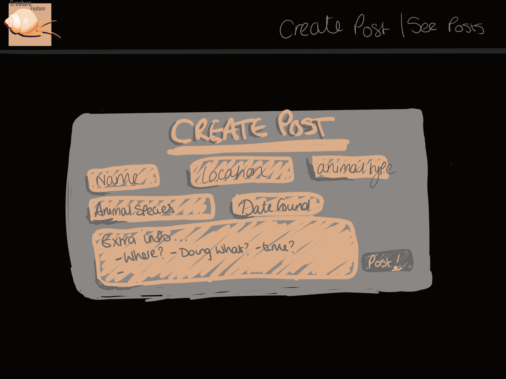
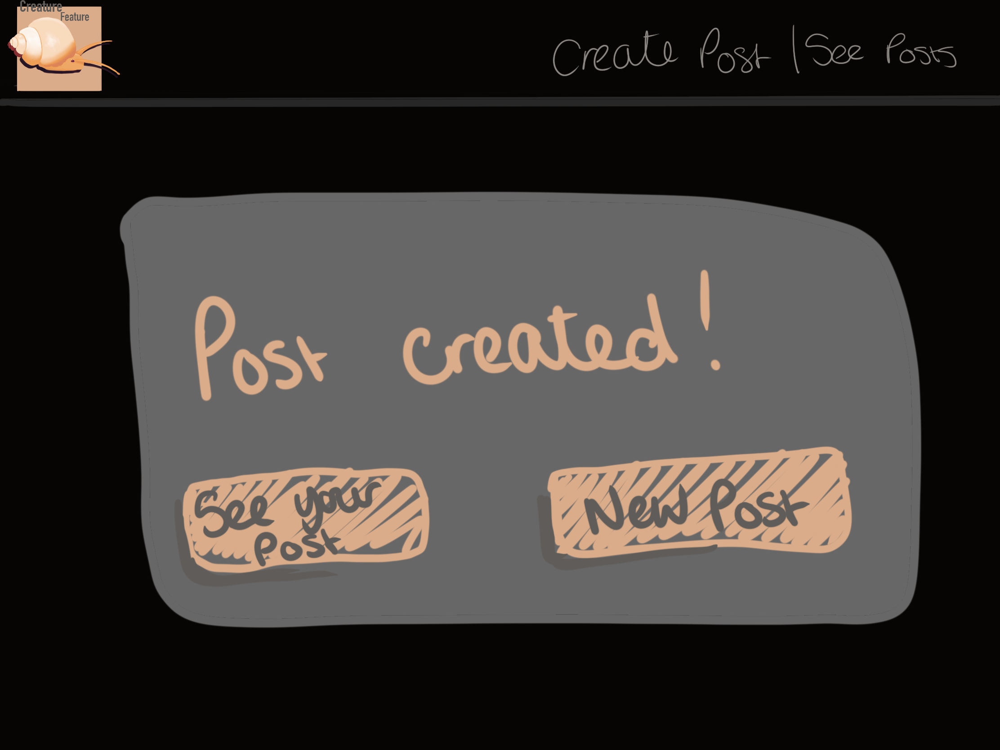
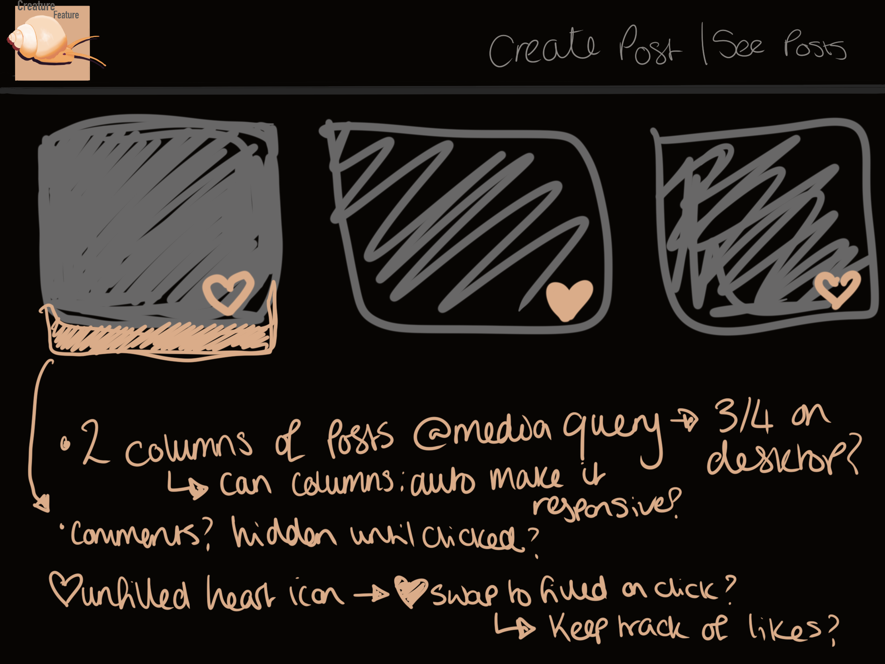

# Tips from Manny:

- Bigger picture is scary, divide project into manageable steps! (use lists)
- Deploy as soon as possible
- plan!!!!!!!!!

# User Stories

- 🐿️ As a user, I’d like to fill out a working form so that I can submit my information effectively and without issues.
- 🐿️ As a user, I want the application to work as expected on my mobile device so that I can access and use it conveniently on the go.
- 🐿️ As a developer, I want to create a working API GET route so that I can retrieve data from the server and display it to the users.
- 🐿️ As a developer, I want to create a working API POST route so that users can send data to the server and store it.
- 🐿️ As a developer, I want to create and seed a database with dummy data so that I have realistic test data for development purposes.

# Requirements

- 🎯 Ensure your HTML form is working and submitting data into the database as expected.
- 🎯 Confirm that your project is functional on multiple screen sizes using either Responsive Design or media queries.
- 🎯 Create a working GET API route in your server.
- 🎯 Create a working POST API route in your client.
- 🎯 Seed your database with realistic-looking ‘dummy’ data through the Supabase query editor or a seed file in your server. Ensure that this is saved and submitted (in a screenshot or seed file form) so it can be marked and tested efficiently.

# Adjustments made/issues faced

- I started with the following function:

```
  async function renderPost(postData) {
  for (let i = 0; i < postData.length; i++) {
  const name = postData[i].name;
  const nameP = document.createElement("p");
  nameP.textContent = name;
  const location = postData[i].location;
  const date = postData[i].date;
  const animal = postData[i].animal;
  const species = postData[i].species;
  const info = postData[i].info;
  const feed = document.getElementById("feed");
  const postContainer = document.createElement("div");
  feed.appendChild(postContainer);
  feed.appendChild(nameP);
  }
  }
```

but it started to feel like it would be very repetitive, making p elements and declaring them etc, so I pivoted to using a function with 'text' as it's parameter that creates a p tag, assigns it a text content. When I call it, I can add the postData[i].valueNeeded so that I don't need to declare each individual value.

- I got my createdpost/form to swap as intended BUT when I click the a attribute that takes you to the feed section, the new post does not show as there is no reloading happening. I need to create a function that onclick of the a attribute with reload the page AND scroll you to the feed.

  - if I use getpostdata() this would refresh.
  - FIXED = I just needed to add getpostdata(), then change what divs are hidden and reset the form again!

- Like button, I knew to do this (without tracking, purely client visuals) it could be as simple as swapping the source. I made it go from unsolid heart to a solid heart BUT I struggled to swap it back again with my if statement.

# Resources

- https://stackoverflow.com/questions/32378590/set-date-input-fields-max-date-to-today - used for setting max date in form.
- https://www.youtube.com/watch?v=wARbgs5Fmuw - used for learning more about responsive typography
- https://www.w3schools.com/howto/howto_js_toggle_like.asp -used for swapping BACK to unliked heart.
- 
- 
- 
